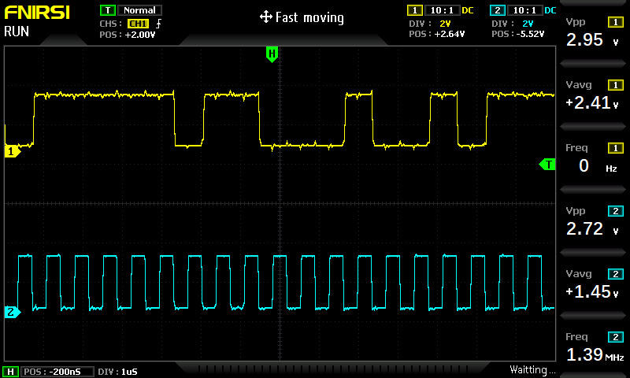
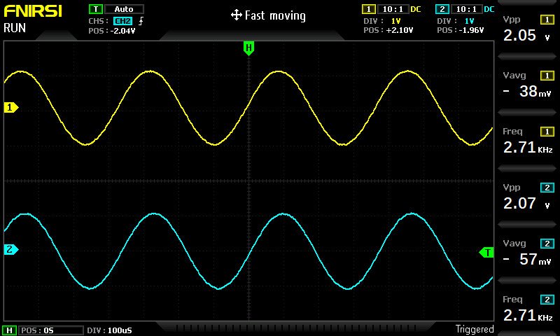

  
  

  
  
  
  

## About
Since at this point in time, there is very little information available on how to use a [nrf5340dk board](https://www.nordicsemi.com/Products/Development-hardware/nRF5340-DK/GetStarted?lang=en) in combination with an I2S DAC chip ([Adafruit I2S Stereo Decoder - UDA1334A](https://www.adafruit.com/product/3678) in my case), the code in this repository will give you a brief overview on how you can achieve this goal.

This sample is based on the [Zephyr I2S testcases](https://github.com/anangl/zephyr/tree/16a1c81d6f2becbf561a615337de8ba65af31533/tests/drivers/i2s/i2s_api/src) (copied sine wave data_frame table), as well as the [I2S Echo sample](https://github.com/zephyrproject-rtos/zephyr/tree/main/samples/drivers/i2s/echo). Please take a look at these samples if you want to get further information on how you can use the I2S driver itself.

Furthermore, the concrete API definitions can be found [here](https://docs.zephyrproject.org/latest/reference/audio/i2s.html).

## Basic principle
To be able to talk to I2S devices, one has to  follow (more or less) the following steps:
- **Step 1**: Get the I2S device from the [devicetree](https://docs.zephyrproject.org/latest/guides/dts/howtos.html#use-devicetree-overlays)
- **Step 2**: Allocate a [memory slab](https://docs.zephyrproject.org/latest/reference/kernel/memory/slabs.html)
- **Step 3**: Configure the I2S device
- **Step 4**: Allocate memory blocks in the memory slab
- **Step 5**: Trigger the start of the data transmission
- **Step 6**: Fill the memory blocks with your data (e.g. sine wave)
- **Step 7**: Use `i2s_trigger(...)` to write the data to the I2S device

All of these steps are explained in greater detail inside the `main.c` file itself!

## Result of the sample code
If you flash the sample code to a bare nrf5340dk board and probe the pins `P1.15` (`47` in the overlay) and `P1.13` (`45` in the overlay), you can see that the chip generates a nice clock signal (blue trace) and the corresponsing the data signal (yellow trace).

If you now attach the DAC board to the nrf5340 board, you should see the corresponding analog output:

🎉  we successfully created an analog signal on an I2S DAC chip!

## Limitations

This Software is provided as-is!

Please feel free to adapt it to your needs and contribute to the project. I would be very grateful to include your improvements. Thanks for your support!

**WARNING:** Everyone is responsible for what he/she is doing! I am not responsible if you hurt yourself, torch your house or anything that kind trying to do build something new! You are doing everything at your own risk!
